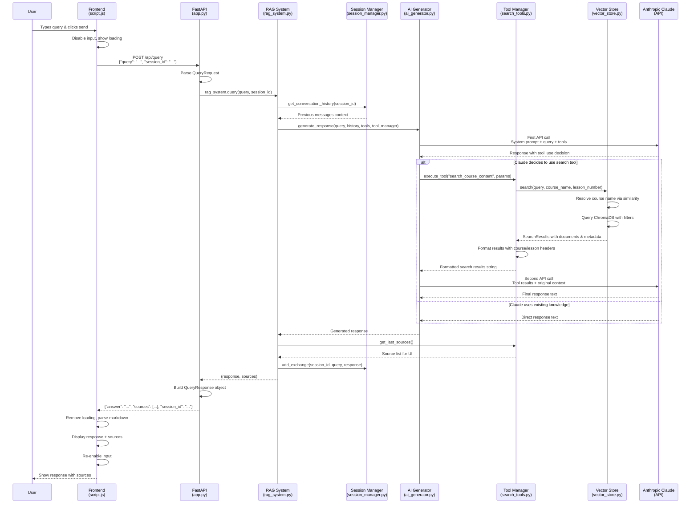

# Query Flow Diagram

## Flow Summary

### 1. **User Interaction**
- User enters query in chat interface
- Frontend disables input and shows loading animation

### 2. **API Request**
- POST to `/api/query` with JSON payload
- Session ID included for conversation continuity

### 3. **RAG Orchestration**
- Retrieve conversation history for context
- Pass query to AI generator with available tools

### 4. **AI Processing**
- Claude analyzes query and decides whether to search
- If search needed: executes course search tool
- If no search: uses existing knowledge

### 5. **Vector Search** (if triggered)
- Resolve course names via semantic similarity
- Query ChromaDB with course/lesson filters
- Format results with contextual headers

### 6. **Response Generation**
- Claude generates final response using search results
- Sources tracked and extracted for UI display
- Session updated with query/response pair

### 7. **Frontend Display**
- Parse markdown response for rich formatting
- Show sources in collapsible section
- Re-enable input for next query

## Key Components

- **Session Management**: Maintains conversation context
- **Tool Orchestration**: AI decides when to search vs. use knowledge  
- **Vector Search**: Semantic similarity for course/content matching
- **Source Attribution**: Track and display result origins
- **Error Handling**: Graceful fallbacks throughout the flow